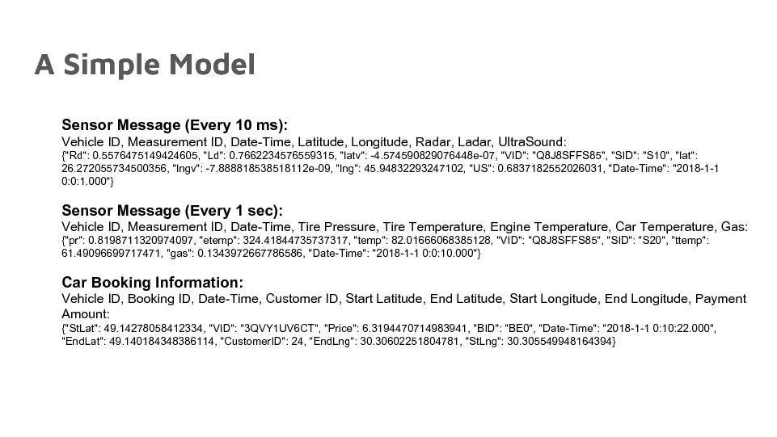
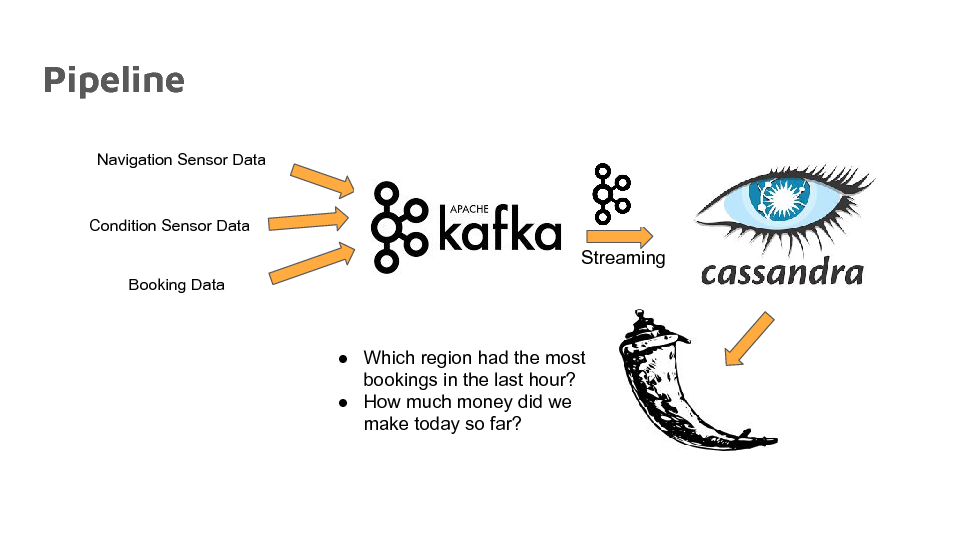

# Table of Contents
1. [Introduction](README.md#Introduction)
2. [Model](README.md#Model)
3. [Pipeline](README.md#Pipeline)
4. [Requirements](README.md#Requirements)
5. [Directory](README.md#Directory)
6. [Additional](README.md#Additional)

# Introduction
This is a message handling system for autonomous vehicles. Autonomous vehicles are the future of transportation and they will be producing a lot of data. According to some sources, it is expected that around 4TB of data will be produced per day per car. This includes information from the car GPS, Radar, Ladar, Camera and so on. That information (or some of it) will be sent to data-centers that will then be able to navigate the cars. For a service company with a fleet of many of those cars, a data management system is needed to handle all the data received.  
This project is the implementation of a system that is able to receive some of that information, process it and store it in a form that enables quick access to relevant information.

# Model
I assumed a simple model for the types of messages received.  
1. First there are navigation sensor data that need to be received every 10 ms to be able to drive the car safely. This includes the GPS position and speed information, Radar, Ladar, Ultrasound ...  
2. Then there are the vehicle condition sensor data received every 1 sec and used to check the condition of the car. This includes temperature, tire pressure, gas meter ...  
3. Then there is the car booking information which, when aggregated, is used to make business decisions in near real-time.  
The schema of these messages is shown in the following figure:  

# Pipeline
The code here implements the pipeline shown below. It consists of ingesting the data from the source using Kafka, and then using Kafka Streaming to load the navigation data into Cassandra, a key-sorted key-value store where they are stored by car ID and in descending time order for easy retrieval. The booking information is also processed using Kafka Streaming to return the bookings that occurred per hour and per spatial block. This information will help the company make real-time decisions about whether certain blocks are getting higher demand than usual and therefore send more vehicles to that location.  

# Requirements
I used:  
Kafka 0.10.1.1   
Cassandra 3.11.0  
Datastax java cassandra-driver (https://github.com/datastax/java-driver)  
Jackson libraries for JSON Parsing (https://github.com/FasterXML/jackson)
JDK 8  
Flask (pip install Flask)
Tornado (pip install tornado)

# Directory
The directory structure for this repo looks like this:

    ├── README.md 
    ├── images
    │   └── Pipeline.jpg
    │   └── Schema.jpg
    └── src
        └── GenerateData
            └── GenMain.py
            └── GenClasses.py
            └── run.sh
        └── Producers
            └── CarTakerProducer.java
            └── Config.txt
            └── run.sh
        └── KSConsumers
            └── StreamSensorConsumer.java
            └── StreamBookingConsumer.java
            └── Config.txt
            └── run.sh
        └── Flask
            └── app
                └── static
                └── templates
                └── _init_.py
                └── views.py
            └── tmp
            └── run.py
            └── tornadoapp.py

## Directory Description
**src:** Contains the source code  
**GenerateData:** Code for generating the data used. Includes **GenMain.py** (the run code) and **GenClasses.py** (the supporting classes) as well as the run file.  
**Producers:** Code for the Kafka producer **CarTakerProducer.java** as well as the **Config.txt** which has the server ip address for the Kafka cluster and the run file for the compilation instructions  
**KSConsumers:** The Kafka Streams consumers code including the Sensor data consumer **StramSensorConsumer.java** and the Booking data consumer **StreamBookingConsumer.java**, the **Config.txt** file which has the addresses for the Kafka and Cassandra clusters and the compilationinstructions in the **run.sh** file.  
**Flask:** The Flask app for running the website. This is a standard Flask directoy. The **views.py** includes the routing code and the templates directory has the html source code. To run: sudo -E python tornadoapp.py.

# Additional
To describe a certain topic in Kafka:  
../bin/kafka-topics.sh --describe --zookeeper localhost:2181 --topic mytopic  
To alter the partitions of a particular topic:  
../bin/kafka-topics.sh --alter --zookeeper localhost:2181 --topic S1 --partitions 6  
To list all topics:  
../bin/kafka-topics.sh --list --zookeeper localhost:2181  

